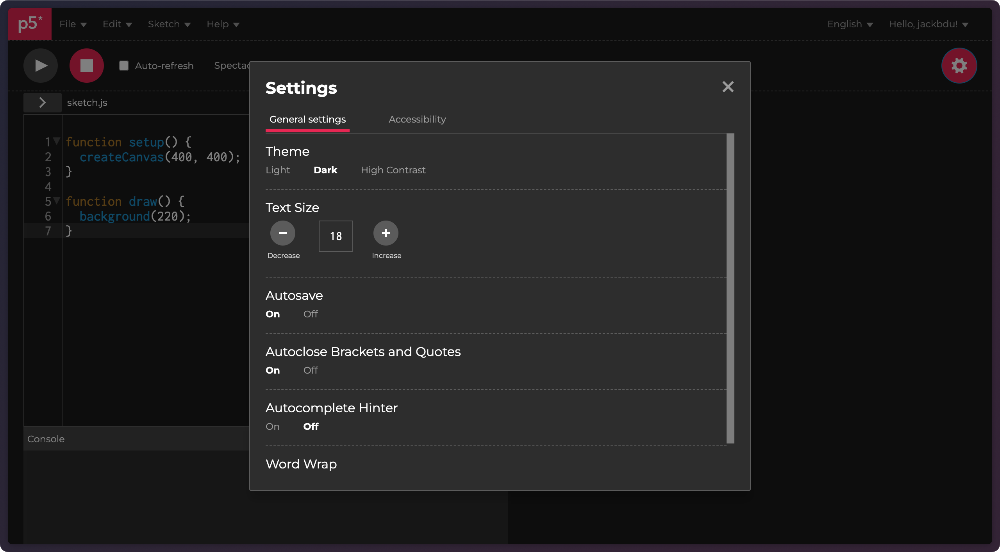
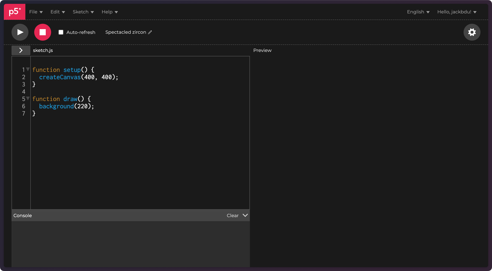
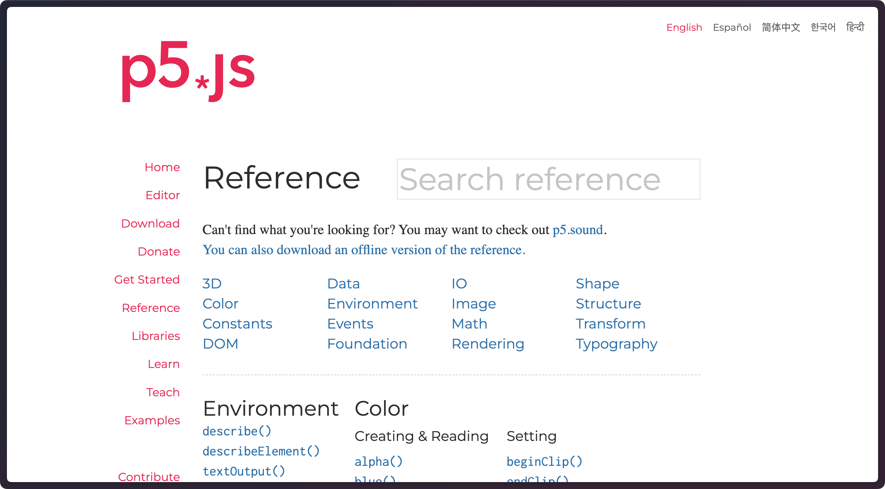
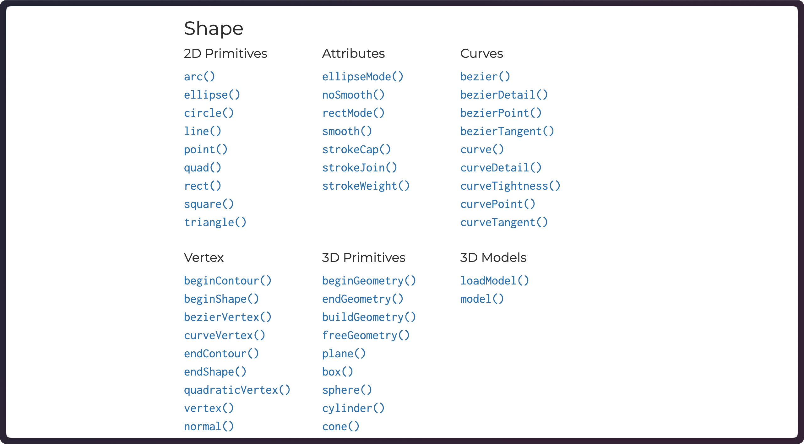

# p5.js Fundamentals

## 0.0 Code Editor

One of my favorite things about p5.js is that it runs on the web, which means we can create an entire project without leaving our web browser. The p5.js Web Editor, [originally created by Cassie Tarakjian](https://medium.com/processing-foundation/a-p5-js-web-editor-for-all-64aaa3f9d767), is the official code editor for p5.js supported by the Processing Foundation.

Let's start by opening [the p5.js Web Editor](https://editor.p5js.org/) in a new tab.

###  0.0.1 Account and Settings

Though not required, if you are following along this tutorial, I highly recommend creating an account by clicking _Sign up_ at the top-right corner of the web editor.

After signing up, we'll be able to save our projects (a.k.a sketches) in our account, which reduces the likelihood of us losing our hard-written code. (Yes, one can only reduce such likelihood, because there is always a _creative_ way to lose code. Fret not, later I will share a few techniques to further reduce the possibility of such heart-broken moments.)

In addition, we'll be able to save our editor preferences, which can be found by clicking the gear icon :gear: at the top-right corner. Below is a screenshot of my settings:



I personally prefer a dark theme whenever I code because I will be staring at my screen quite a lot and I'd rather not have bright light shining into my eyes.

The only other setting that I change is __Autoclose Brackets and Quotes__. When this is _On_, the editor automatically closes our opening brackets such as `(`, `[`, `{` by adding their cooresponding closing brackets such as `)`, `]`, `}`, which we will be using a lot in coding. In theory, this helps us avoid incomplete brackets, but in my experience, beginners tend to be confused about the unexpected brackets. Personally, I also prefer to type my own brackets so I know exactly what I am typing.

Ultimately, all these settings are up to you as long as you are aware what they are.

### 0.0.2 Interface



Upon opening the web editor, we see a menu bar at the very top, which include submenus that allow us to create new sketch, save current sketch, find and replace text, etc.

Right below that, there is a play button :arrow_forward:, a stop button :stop_button:, and a pencil icon :pencil2: next to some generated text, which is where we can edit the name of our sketch. Let's give our sketch a good name and click _File > Save_ in order to save our sketch.

Finally, we are getting to the largest sections of the editor. One the left-hand side, we see `sketch.js` and some text with numbered lines, this is where we will be viewing and editing the source code. Right below that, we see _Console_, which is where we will see messasages (such as log or error messages) from our sketch. On the right-hand side, we see _Preview_, which displays a preview of our sketch when we click the play button :arrow_forward:. A sketch is essentially a webpage, so the preview is essentially a preview of the webpage. Most of the time, we will be dealing with a `canvas` on this webpage, which is webpage component (technically, it's called an [HTML `<canvas>` element](https://developer.mozilla.org/en-US/docs/Web/HTML/Element/canvas), but we don't really need to worry about it right now).

Note that new changes to the source code will not be reflected in the preview until the play button :arrow_forward: is clicked again unless __Auto-refresh__ is enabled. (I do not recommend enabling it as it may cause our browser to freeze in some cases. Remember that I told you I will share more tips on saving our precious code?)

## 0.1 Default Sketch

If you are opening the web editor for the first time, or whenever you create a new sketch, you'll see some code like this:

```javascript
function setup() {
  createCanvas(400, 400);
}

function draw() {
  background(220);
}
```

[ [Open Sketch in Web Editor](https://editor.p5js.org/jackbdu/sketches/FRNrT6mI7) ]

First things first, [`setup()`](https://p5js.org/reference/#/p5/setup) and [`draw()`](https://p5js.org/reference/#/p5/draw) are called [__functions__](https://p5js.org/reference/#/p5/function). We can probably guess that because they are preceded by the keyword `function`. We'll learn more about functions later, but for now, we only need to know that functions usually perform some actions. More specifically, `setup()` and `draw()` are two functions that p5.js recognize and their main differences lie in how often they run (i.e. how often their actions are carried out). Since p5.js is primarily used for visuals, we can think of the sketches as paintings. The `setup()` function does the preparation work (hence runs only once before `draw()`) whereas the `draw()` function actively and repeatedly paint things onto our canvas until we stop our sketch or until we explicitly ask it to stop.

Now, let's take a closer look at the `setup()` function. It is followed by a opening curly brace `{`, which is later closed by its matching closing curly brace `}`. Everything between `{` and `}` specifies exactly what the `setup()` function does (i.e. the code to run). In this case, `createCanvas(400, 400);`. One line of code like this ended with a semicolon `;` is called a __statement__. This statement, as you guessed it, creates a canvas for us to draw on. What are the two numbers? You might be able to guess, but we can also learn by trial and error. What if we change the statement to `createCanvas(200, 400)` and run the sketch again (by clicking the play button :arrow_forward:)? What about `createCanvas(400, 150)`? Hopefully, by now, you have realized that the first number represents the width of the canvas and the second number represents the height of the canvas.

Congratulations! You have just learned how to program, and you are ready to embark the rest of the journey on your own!

Hehe, not so fast? If you are still here, let's embark on this journey togther!

Similarly, within the `draw()` function, we can try changing the number in the statement `background(220);` and run the sketch to see what this number does. For instance, `background(100);` appears to make the canvas darker, and `background(255)` appears to make the canvas lighter. What about `background(300);` or `background(400);`? Do they make the canvas even lighter? The answer is no. That is because, in p5.js, colors are represented on a scale from `0` to `255` by default with `0` being solid black and `255` being solid white.

Now we know what [`createCanvas()`](https://p5js.org/reference/#/p5/createCanvas) and [`background()`](https://p5js.org/reference/#/p5/background) do, but what are they? It turns out they are also functions. However, you might have noticed that they are not preceded by the keyword `function`, why? The keyword `function` is actually used to create new functions. That is to say, `setup()` and `draw()` functions do not exist until we write `function setup() { ... }` and `function draw() { ... }` in our code, whereas `createCanvas()` and `background()` are functions that already exist in p5.js. Whenever we see a function without the keyword `function`, it is called to __call__ or __invoke__ a function, which means to use that function to perform its prescribed actions. Additionally, `createCanvas()` and `background()` can use these comma-separated numbers (called __arguments__) to affect its actions.

To recap, in the default sketch source code, we are creating two functions, one named `setup()` and the other named `draw()`, which are standard functions that are recognized by p5.js. `setup()` runs only once and `draw()` runs continously immediately afterwards. Within `setup()`, `createCanvas(400, 400);` creates a canvas with a width of `400` pixels (first number) and height of `400` pixels (second number). Within `draw()`, `background(220);` draws a light-gray background on the canvas.

## 0.2 Write Our Own Code

Now that we've understood the default sketch, let's dig in and write our own code.

### 0.2.1 Shapes

First off, let's try to draw a circle on the canvas. In order to do that, we add a [`circle()`](https://p5js.org/reference/#/p5/circle) function inside the `draw()` function as below:

```javascript
function setup() {
  createCanvas(400, 400);
}

function draw() {
  background(220);
  circle(200, 200, 100);
}
```

[ [Open Sketch in Web Editor](https://editor.p5js.org/jackbdu/sketches/PckAgQY7g) ]

Now we have a circle at the center of the canvas. Notice how I put this statement after `background(220);`? If I swap them, and put `circle(200, 200, 100);` before `background(220);`, we won't see a circle. Why? That is because statements are excuted sequentially. You see the circle if you draw the background first, but you won't see the circle if you draw the circle first, because the background will cover the circle that we draw (imagine painting the entire canvas over with light-gray paint after paint a circle first).

Following a similar trial-and-error approach, we can try changing each argument and see what happens. We'll quickly learn that the first argument affects the horizontal position of the circle, the second argument affects the vertical position of the circle, and the last argument affects the size of the circle. If you happen to have learned the [Cartesian coordinate system](https://en.wikipedia.org/wiki/Cartesian_coordinate_system) in geometry, it is not hard to tell that the first argument represents `x` and the argument represents `y`. However, if you are look closely, you may notice that the `y` axis here is the opposite. In p5.js, by default, the origin of its coordinate system is at the top-left corner. So `circle(0, 0);` draws a circle whose center is precisely at the top-left corner of the canvas. Finally, the third and last argument presents the diameter of the circle in pixels.

While learning by trial and error is rewarding when working with simple functions, it can also be time-consuming and frustrating if we cannot figure out what a function does. Without an example, how do we even know `circle()` requires three arguments? Indeed, it is impossible for us to guess all the functions that p5.js has to offer, and that's why there is a [p5.js reference page](https://p5js.org/reference/). We can find this reference page within the web editor menu bar by going to _Help > Reference_.



Voilà! The answers to all our questions!

Now, if we want to draw a different shape, we can simply look it up in the reference. For instance, we can click _Shape_ and we'll jump to the section where all functions related to shapes are listed.



### Exercise

With the help of the reference, learn how to use [`line()`](https://p5js.org/reference/#/p5/line), [`rect()`](https://p5js.org/reference/#/p5/rect) and [`triangle()`](https://p5js.org/reference/#/p5/triangle). Use all these shapes to draw your favorite animal or plant. Feel free to explore other shapes as well.

### 0.2.2 Variables

We've just drawn a circle with numbers as its arguments. What if we want to give each number a name? We can do something like this:

```javascript
function setup() {
  createCanvas(400, 400);
}

function draw() {
  background(220);
  const x = 200;
  const y = 200;
  const d = 100;
  circle(x, y, d);
}
```

[ [Open Sketch in Web Editor](https://editor.p5js.org/jackbdu/sketches/aTcRbaxqq) ]

These names that we declared, `x`, `y`, and `d`, are called __variables__. We can use three different keywords to declare a variable, namely, [`const`](https://p5js.org/reference/#/p5/const), [`let`](https://p5js.org/reference/#/p5/let), and `var`:

- `const` is used to declare a variable that should not be changed.
- `let` is used to declare a variable that might be changed.
- `var` is the older way to declare a variable, we won't be using it in our tutorials, but you may encounter that in other people's code.

Generally speaking, use `const` whenever you can unless you need to change the variable later.

These four lines of code does exactly the same thing as `circle(200, 200, 100);`, so why bother turning one line of code into multiple lines? Both methods are correct, but in my opinion, using variables improve readability. It might seem trivial with one circle, but once we start drawing more than one circle, these variables can help keep our code much more organized. Here is an example:

```javascript
const x = 200;
const y = 200;
const d1 = 200;
const d2 = 100;
const d3 = 50;
circle(x, y, d1);
circle(x, y, d2);
circle(x, y, d3);
```

### 0.2.3 Animation

Drawing a circle at the center of the canvas really isn't the most exciting thing. What if I tell you that we can make it move? Moving the circle essentially means changing the value of `x` and/or `y`. Remember how I mentioned we need to use the keyword `let` to declare variables that change values? Let's do that.

```javascript
let x = 200;
let y = 200;
const d = 100;

function setup() {
  createCanvas(400, 400);
}

function draw() {
  background(220);
  circle(x, y, d);

  x = x + 1;
  y = y + 1;
}
```

[ [Open Sketch in Web Editor](https://editor.p5js.org/jackbdu/sketches/LYPJCghGt) ]

This sketch will draw a circle at the center of the canvas and then the circle will slowly move towards the bottom-right corner of the canvas.

This is the first time we've seen any code outside `setup()` or `draw()`. This area is called __global scope__ and variables in the global scope is called __global variables__. They are global, because we will be able to use these variables anywhere after they are declared, which includes within `setup()` and `draw()`. If we move the variable declarations to `setup()`, we will see an error message in our console `ReferenceError: Can't find variable: x`. That is because variables declared within a function is only accessible within that function.

Similar to `setup()`, code in the global scope runs only once. So the values that we assign to the variables are only the initial values for them, which are modifed later in `draw()` with `x = x + 1;` and `y = y + 1;`.

Whenever there is a single equal sign `=` and some operation like `x + 1` or `y + 1` on its right side, the operation is first performed and its result is then assigned to the left side. In this case, `1` is added to `x` or `y` and then reassigned to `x` or `y`. So `x` or `y` is essentially incremented by `1`. Since the value of `x` is initally `200`, after running `x = x + 1` once, the value of `x` is now `201`. Why does it keep incrementing without a stop? Do you still remember that `draw()` runs continuously without a stop? In fact, by default, `draw()` runs roughly `60` times per second as long as our computer is able to handle it. This speed is called __frame rate__ and its unit is __FPS__ (Frame Per Second). We can change the frame rate of our sketch using the [`frameRate()`](https://p5js.org/reference/#/p5/frameRate) function. Since a const frame rate is usually preferred, we can put this function in `setup()`. Our `setup()` function will look like this:

```javascript
setup() {
  createCanvas(400, 400);
  frameRate(10);
}
```

Try changing the frame rate and see it affects the circle's movement. The slower the frame rate, the slower the movement. In addition, the smaller the frame rate, the choppier the movement becomes (the motion becomes less smooth). This is why we usually keep our frame rate at a high value such as `60`. For reference, movies are usually played at 24 FPS in theater, and most common computer monitors are 60 Hz (i.e. the maximum frame rate they can display is 60 FPS).

Back to the `draw()` function, the frame rate controls the number of times the function runs per second. With the frame rate being `60`, `draw()` function runs 60 times per second, which means `x = x + 1` is executed 60 times within a second. After the first second of the sketch running, the circle moves from `200, 200` to `260, 260`.

Similarly, to move the circle to the opposite direction, we can change `+` to `-`. In fact, since these two operations, `x = x + 1` and `x = x - 1`, are so commonly used in programming, there are shorthands for them, namely, `x++` and `x--` respectively.

Additionally, if we would like to increase or decrease a variable by a value different from `1`, there is a different shorthand. `x = x + 2` is the same as `x += 2`, and `y = y - 10` is the same as `y -= 10`. As we increase or decrease `x` and/or `y` by a larger number, the circle moves faster.

### 0.2.4 Interaction

There are lots of potentials in algorithmic animation, but what truly makes coding shine is that our sketches can be interactive.

#### 0.2.4.1 Mouse Position

In p5.js, there are some very helpful built-in variables that we can use. In the sketch below, instead of assigning a number to `x` and `y`, we are using [`mouseX`](https://p5js.org/reference/#/p5/mouseX) and [`mouseY`](https://p5js.org/reference/#/p5/mouseY), which conveniently give us the exact coordinate of the mouse position.

```javascript
const d = 300;

function setup() {
  createCanvas(400, 400);
}

function draw() {
  background(220);
  const x = mouseX;
  const y = mouseY;
  circle(x, y, d);
}
```

[ [Open Sketch in Web Editor](https://editor.p5js.org/jackbdu/sketches/qGghBx2Ud) ]

Now, wherever we move our mouse to, the circle moves to that exact spot.

####  0.2.4.2 Moving to Draw

Let's make a very minor change—moving `background(220);` from `draw()` to `setup()`.

```javascript
const d = 300;

function setup() {
  createCanvas(400, 400);
  background(220);
}

function draw() {
  const x = mouseX;
  const y = mouseY;
  circle(x, y, d);
}
```

[ [Open Sketch in Web Editor](https://editor.p5js.org/jackbdu/sketches/tJ11IuF55) ]

Did you see the difference? The mouse now leaves a trail of circles. How? `background()` is in `setup()`, that means we are only drawing the background once. As `draw()` runs 60 frames/second, we are drawing 60 circles on the canvas every second, and new circles are drawn on top of old circles. Cool, huh?

You may also notice that we are using `const` for `x` and `y` here, but `mouseX` and `mouseY` are clearly different for every frame. Didn't I just say the value of a `const` variable should not change? In fact, if you declare a variable within a function, namely in the __function scope__, the variable only lives within that function. Moreover, these variables are destroyed and redeclared each time the function runs. Therefore, as long as `const` variables stay the same within each frame, which they do, we are safe here.

#### 0.2.4.3 Pressing to Draw


Are you annoyed that circles are drawn whenever you move your mouse? Since we've gotten so far, we might as well make it act like a painting app. (How exciting! We are building our own MS Paint here. :smiley:)

Let's describe our objective—we want to draw circles _if_ mouse is pressed. Guess what, the code for it doesn't look that different.

```javascript
const d = 30;

function setup() {
  createCanvas(400, 400);
  background(220);
}

function draw() {
  const x = mouseX;
  const y = mouseY;
  if (mouseIsPressed) {
    circle(x, y, d);
  }
}
```

[ [Open Sketch in Web Editor](https://editor.p5js.org/jackbdu/sketches/chSD3Bb3z) ]

We are seeing something new here. In `draw()`, we just added an [`if`](https://p5js.org/reference/#/p5/if-else) statement, which is followed by a pair of parentheses `()` and a pair of curly braces `{}`. The parentheses `()` are used to enclose the condition under which the code within the curly braces `{}` should run. In our case, the condition is [`mouseIsPressed`](https://p5js.org/reference/#/p5/mouseIsPressed). This can also be written as `mouseIsPressed === true`. Three equal signs [`===`](https://p5js.org/reference/#/p5/===) indicates it is a test, rather than an assignment, which uses one equal sign `=`. Note that `true` is not a variable, it is a special keyword indicating a data type called __boolean__, which is either `true` or `false`. `mouseIsPressed`, on the other hand, is a variable and it is one of those special variables that p5.js provide us. The value of `mouseIsPressed` depends on whether or not any of our mouse keys is pressed. When any mouse key is pressed, `mouseIsPressed` evaluates to `true`, and if none of the mouse keys is pressed, `mouseIsPressed` evaluates to `false`.

In short, if `(mouseIsPressed)` evalutes to `true`, the code inside `{}` will run, otherwise, nothing happens.

If we want something to happen when `(mouseIsPressed)` evalutes to `false`, we can add an __else__ statement immediately afterwards. For instance, we can use the code below to draw a large circle (with a diameter of 300 pixels) when mouse is pressed, and a small circle (with a diameter of 30 pixels) when mouse is not pressed.

```javascript
const D = 300;
const d = 30;

function setup() {
  createCanvas(400, 400);
  background(220);
}

function draw() {
  const x = mouseX;
  const y = mouseY;
  if (mouseIsPressed) {
    circle(x, y, D);
  } else {
    circle(x, y, d);
  }
}
```

`if` and `else` are what make our sketches "smart", as our sketches can now do different things based on a given condition.

### 0.2.5 Randomness

We've learned how to draw circles at specific positions based on different rules. Now let's draw them at random locations.

```javascript
const d = 30;

function setup() {
  createCanvas(400, 400);
  background(220);
}

function draw() {
  const x = random(0, 400);
  const y = random(0, 400);

  circle(x, y, d);
}
```

[ [Open Sketch in Web Editor](https://editor.p5js.org/jackbdu/sketches/5NuNw84XX) ]

By default, [`random()`](https://p5js.org/reference/#/p5/random) outputs a random number from 0 (inclusive) to 1 (exlusive). We can also manually provide a minimum value (inclusive) as well as a maximum value (exlusive), as in the case of `random(0, 400)`, which outputs a number from `0` to `400` (the number could potentially be `0`, hence inclusive, but could never be `400`, hence exlusive). Since it is very common for the minimum value to be `0`, we can omit that and only specify the maximum value. `random(400)` does exactly the same thing.

This sketch will uniformly draw new circles at a random position anywhere within our canvas. It works pretty well until we change our canvas size to a larger size, such as `createCanvas(600, 600)`. Now the circles are only drawn within the top-left 400-by-400-pixel section of our sketch. Surely, we can quite easily fix that by updating the maximum value for our `random()` functions, but it wouldn't be so easy if we have hundreds of `random()` functions. How do we solve that? p5.js provides yet another pair of "special" variables for us [`width`](https://p5js.org/reference/#/p5/width) and [`height`](https://p5js.org/reference/#/p5/height), which are exactly the same value of the width and height of the canvas, respectively.

Let's rewrite our code:

```javascript
const d = 30;

function setup() {
  createCanvas(400, 400);
  background(220);
}

function draw() {
  const x = random(width);
  const y = random(height);

  circle(x, y, d);
}
```

Now, no matter what size the canvas is, the `random()` function automatically adapts to it so that the random circles will evenly cover the entire canvas.

### 0.2.6 Colors

#### 0.2.6.1 Colorful Shapes

We've come a long way with just black, white, and gray. Let's make things colorful now.

One of the easy ways to specify color is to use color names. For example, `background("red")` will draw a red background. In JavaScript, we use quotation marks `""` or `''` to enclose text, whose data type is __string__ (as in a string or sequence of characters). The quotation marks help us distinguish a string `"red"` from a variable `red`.

Before you get stressed out about memorizing all the English color names, let me show you a few other ways. In p5.js, you can also use multiple numbers to represent a color. By default, if you are using three numbers, such as `background(255, 0, 0)`, these numbers are the __RGB__ (red, green, and blue, respetively) values of the color on a scale from `0` to `255`. So `background(255, 0, 0)` also draws a red background.

In addition to `RGB`, you can use the [`colorMode()`](https://p5js.org/reference/#/p5/colorMode) function to switch to one of the two other color modes— `HSB` (hue, satuaration, brightness) or `HSL` (hue, saturation, lightness). We will be mostly using `RGB`, but feel free to read more about other color modes on [the colorMode() reference page](https://p5js.org/reference/#/p5/colorMode).

Here are a few functions that will be helpful here

- [`fill()`](https://p5js.org/reference/#/p5/fill) sets the color that fills shapes
- [`noFill()`](https://p5js.org/reference/#/p5/noFill) disables fill color
- [`stroke()`](https://p5js.org/reference/#/p5/stroke) sets the color of the outlines of shapes.
- [`noStroke()`](https://p5js.org/reference/#/p5/noStroke) disables stroke color
- [`strokeWeight()`](https://p5js.org/reference/#/p5/strokeWeight) sets the thickness of the stroke

Note that these functions can be used "on the go" to switch between different color settings in `draw()` and they only affect the the shapes that come after them.

Here is an example of multiple shapes in different colors.

```javascript
function setup() {
  createCanvas(400, 400);
}

function draw() {
  background(220);
  fill("pink");
  stroke("brown");
  strokeWeight(2);
  circle(150, 150, 50);
  circle(250, 150, 50);
  fill(255, 0, 0);
  noStroke();
  circle(200, 200, 30);
  noFill();
  stroke(0);
  strokeWeight(5)
  rectMode(CENTER);
  rect(200, 250, 100, 30);
}
```

[ [Open Sketch in Web Editor](https://editor.p5js.org/jackbdu/sketches/7UEzpdShb) ]

#### 0.2.6.2 Random Colors

One advantage of using numbers instead of names for color is the ability to control colors algorithmically. Let's use `random()` to choose random values for our colors.

```javascript
const d = 30;

function setup() {
  createCanvas(400, 400);
  background(220);
}

function draw() {
  const x = random(width);
  const y = random(height);
  const r = random(255);
  const g = random(255);
  const b = random(255);
  fill(r, g, b)
  circle(x, y, d);
}
```

[ [Open Sketch in Web Editor](https://editor.p5js.org/jackbdu/sketches/Rio-Yif_A) ]

This sketch draws circles in competely random colors. If we want to use only bright colors, we can specify the minimum values for our `random()` functions. Instead of `random(255)` which gives us a number between `0` to `255`, we can use `random(150, 255)` to ensure all three values are larger than `150` hence brighter.

### 0.3 Summary

This wraps up the fundamentals of p5.js. Now we have the necessary programming knowledge to start our journey of learning machine learning with ml5.js.
